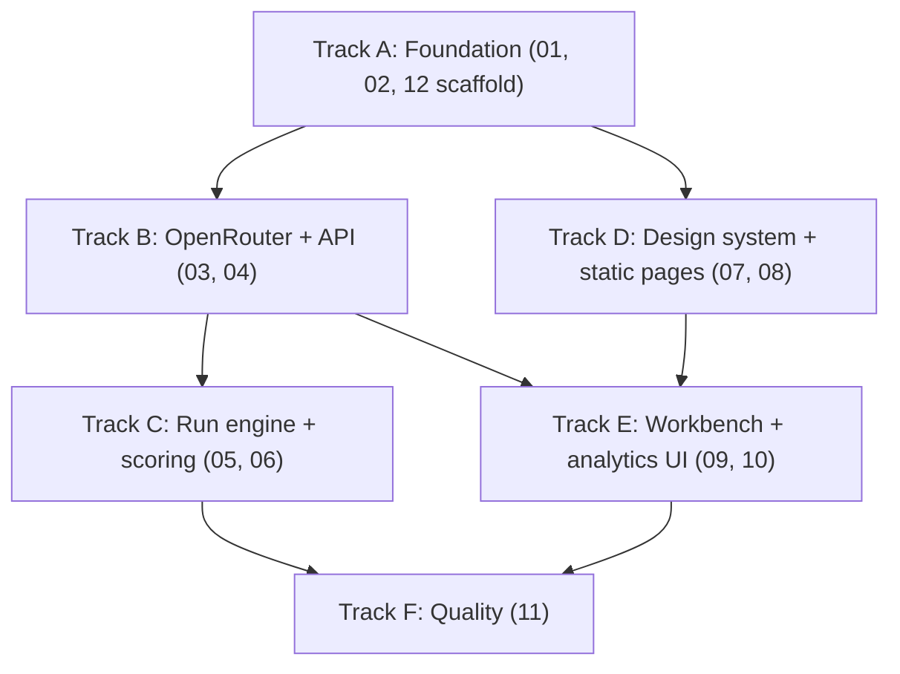

# AI Judge — Plans Dispatch Board

**AI Judge** is a single-operator benchmark lab: Next.js 15 + TypeScript + Tailwind + SQLite (better-sqlite3) app that sends an immutable 8-category prompt bundle to candidate models via OpenRouter, streams answers live over SSE, runs deterministic validators, has a seeded blind 3-LLM-judge panel score each answer, and aggregates results into bundle-scoped leaderboards.

## Per-model work orders

Four self-contained briefs in `agents/`, one per AI model, each bundling the tracks below into a single work order (mission, reading list, owned files, forbidden paths, contracts, done-criteria, kickoff prompt). Execution order: Database first; Backend and Frontend in parallel after it; Quality last.

| Work order | Maps to tracks | Plan files covered |
|---|---|---|
| [agents/README-DATABASE.md](agents/README-DATABASE.md) | Track A | 01, 02 + scaffold/env of 12 |
| [agents/README-BACKEND.md](agents/README-BACKEND.md) | Tracks B + C | 03, 04, 05, 06 |
| [agents/README-FRONTEND.md](agents/README-FRONTEND.md) | Tracks D + E | 07, 08, 09, 10 |
| [agents/README-QUALITY.md](agents/README-QUALITY.md) | Track F | 11 + scripts/backup/security of 12 |

## How to use this folder

Each numbered file is a **self-contained spec**: purpose, detailed spec, files to implement, contracts with other modules, and acceptance criteria. An implementing agent should:

1. Read `00-overview.md` first — it defines the shared vocabulary (table names, statuses, SSE events, categories, file layout) that every module uses verbatim.
2. Then read **only its assigned plan file(s)** from the track table below.
3. Implement exactly the files listed in its plans' "Files to implement" sections — nothing else.

## File index

| Plan file | Module | Scope | Source files produced |
|---|---|---|---|
| [00-overview.md](00-overview.md) | Shared contracts | Goal, stack, route map, canonical table/status/category/SSE contracts, methodology rules. | None directly (governs `lib/schemas.ts`, directory skeleton, `.env.local` template) |
| [01-database.md](01-database.md) | `lib/db.ts` + schema | Full physical SQLite spec: all 13 tables, indexes, WAL, numbered migrations, transactions, key queries. | `lib/db.ts`, migration 001 (all tables + indexes), migration 002 (seed bundle) |
| [02-seed-bundle.md](02-seed-bundle.md) | `lib/bundles/mini-v1.ts` | Verbatim `mini-benchmark-v1` content: wrapper, 8 tasks, judge prompt, output schemas, token limits, content hash. | `lib/bundles/mini-v1.ts` |
| [03-backend-api.md](03-backend-api.md) | `app/api/**` | Every HTTP route as a Zod-validated contract plus the SSE wire protocol with `Last-Event-ID` replay. | 11 `app/api/**/route.ts` files, `lib/schemas.ts`, `lib/api-helpers.ts` |
| [04-openrouter.md](04-openrouter.md) | `lib/openrouter.ts` | Sole OpenRouter client: cached model catalog, streaming chat, usage/cost capture, retries, abort, key handling. | `lib/openrouter.ts` (+ schema additions to `lib/schemas.ts`, `models_cache` DDL requirement) |
| [05-run-engine.md](05-run-engine.md) | `lib/run-engine.ts` | Durable in-process state machine: queue, checkpoints, seeded panels, blind judging, substitution, pause/resume/cancel, recovery. | `lib/run-engine.ts`, `lib/prng.ts` |
| [06-scoring-judging.md](06-scoring-judging.md) | `lib/scoring.ts` + `lib/validators/` | Deterministic validators per category (math 552/432), score pipeline (median/disagreement/macro-average), judge calibration, cost estimation. | `lib/validators/common.ts`, `lib/validators/math.ts`, `lib/validators/index.ts`, `lib/scoring.ts`, `lib/fixtures/calibration/*.json` |
| [07-design-system.md](07-design-system.md) | Design system | Dark-only "lab instrument" visual language: tokens, typography, motion, a11y, and all shared UI primitives. | `app/globals.css`, `app/layout.tsx`, `lib/cn.ts`, `lib/format.ts`, ~21 `components/ui/*.tsx` (AppShell, ScoreBadge, DataTable, Drawer, …) |
| [08-frontend-pages.md](08-frontend-pages.md) | Static pages | `/`, `/models` (virtualized catalog + ModelPicker), `/bundles`, `/settings` with loading/empty/error states. | `app/page.tsx`, `app/models/*`, `app/bundles/*`, `app/settings/*`, `app/api/settings/*`, `components/landing|models|bundles|settings/*`, `lib/fuzzy.ts` |
| [09-run-workbench.md](09-run-workbench.md) | Run workbench | `/run` four-step wizard and `/runs/[id]` live arena: grid, cell drawer, SSE client with reconnect/rehydration. | `app/run/page.tsx`, `app/runs/[id]/*`, `components/run/*`, `components/arena/*`, `lib/client/useRunStream.ts`, `lib/client/runStore.ts`, `lib/client/runDraft.ts` |
| [10-leaderboard-analytics.md](10-leaderboard-analytics.md) | Analytics UI | `/leaderboard`, `/compare`, `/judges`, the completed-run Report tab, and hand-rolled SVG chart primitives. | `app/leaderboard/*`, `app/compare/*`, `app/judges/*`, `components/charts|leaderboard|compare|judges|report/*` |
| [11-testing-verification.md](11-testing-verification.md) | Tests | Vitest units, integration tests against a mock OpenRouter + temp SQLite, Playwright E2E, accessibility checks. | `vitest.config.ts`, `playwright.config.ts`, `tests/unit/*`, `tests/integration/*`, `tests/e2e/*` |
| [12-env-deployment.md](12-env-deployment.md) | Ops / scaffold | create-next-app scaffold, dependencies, env contract, Windows notes, single-process run model, backups, npm scripts. | `package.json`, `tsconfig.json`, `.env.example`, `.gitignore`, `.gitattributes`, `lib/env.ts`, `scripts/migrate.ts`, `scripts/backup.ts`, root `README.md` |

## Ownership tracks for parallel AI models

Six independent tracks. Each track owns only the files listed in its plans' "Files to implement" sections.

| Track | Suggested agent | Plan files | Deliverable | Must NOT touch |
|---|---|---|---|---|
| A "Foundation" | `agent-foundation` | 01-database, 02-seed-bundle, + scaffold steps of 12-env-deployment | Repo scaffold, `lib/db.ts` + migrations, seeded `mini-benchmark-v1`, `lib/env.ts`, scripts. Goes **first**; everything depends on it. | `app/**` pages, `lib/openrouter.ts`, `lib/run-engine.ts`, `lib/scoring.ts`, components |
| B "OpenRouter + API layer" | `agent-api` | 03-backend-api, 04-openrouter | All 11 API routes, SSE endpoint, `lib/schemas.ts`, `lib/api-helpers.ts`, `lib/openrouter.ts`. | DB migrations, `lib/run-engine.ts` internals (call it via its interface), all UI |
| C "Run engine + scoring" | `agent-engine` | 05-run-engine, 06-scoring-judging | `lib/run-engine.ts`, `lib/prng.ts`, `lib/validators/*`, `lib/scoring.ts`, calibration fixtures. | API route files, `lib/openrouter.ts` internals (sole consumer of `streamChat`), all UI |
| D "Design system + static pages" | `agent-design` | 07-design-system, 08-frontend-pages | Tokens, `components/ui/*` primitives, AppShell, landing/models/bundles/settings pages, ModelPicker, `app/api/settings/*`. | `lib/db.ts`, engine/scoring/openrouter modules, run/arena/leaderboard components |
| E "Run workbench + analytics UI" | `agent-workbench` | 09-run-workbench, 10-leaderboard-analytics | Run wizard, live arena + SSE client, leaderboard/compare/judges pages, charts, report tab. | `components/ui/*` (import only), `lib/schemas.ts` (import only), all backend `lib/` modules |
| F "Quality" | `agent-quality` | 11-testing-verification | Vitest + Playwright configs, unit/integration/E2E/a11y test suites. Runs **last** — tests everything, changes nothing. | All application code (test files and test configs only) |

## Dependency graph

A first; B and D start in parallel once A lands; C needs B (streamChat, schemas); E needs B (API contracts) and D (UI primitives); F last.

## Shared contracts — the "do not break" list

Canonical facts from `00-overview.md` that every model must respect regardless of track:

- **The 8 categories (exact, lowercase):** `roleplay, coding, math, research, marketing, poster, story, judging`. Never abbreviated or re-cased in data or APIs.
- **`task_results.status` values:** `pending`, `streaming`, `validating`, `judging`, `scored`, `error`. Legal transitions: `pending → streaming → validating → judging → scored`; any non-terminal `→ error`; retry resets `error → pending`. Nothing else.
- **`runs.status` values:** `queued`, `running`, `paused`, `completed`, `cancelled`, `incomplete`.
- **SSE event names:** `run.status`, `task.status`, `candidate.delta`, `candidate.complete`, `validation.complete`, `judge.started`, `judge.delta`, `judge.complete`, `task.scored`, `run.cost`, `notice`, `run.complete`, `resync`, `heartbeat` — monotonic integer event IDs per run, `Last-Event-ID` replay, payload shapes per `00-overview.md` §4.5 / Zod schemas in `lib/schemas.ts`.
- **13 SQLite tables (exact snake_case):** `bundles`, `tasks`, `models_cache`, `runs`, `run_candidates`, `run_judge_pool`, `category_judge_panels`, `task_results`, `validator_results`, `judgment_attempts`, `task_scores`, `bundle_run_scores`, `judge_calibration_results` — plus auxiliary `run_events` (durable SSE log) and `app_settings` (operator defaults).
- **Math ground truth:** exactly **free = 552, paid = 432**. Pinned; derived nowhere else; strict integer comparison.
- **Blind seeded panels:** judge prompts NEVER contain candidate identity; each category gets one seeded 3-judge panel (persisted with `reserve_order`) that judges every candidate; a panel member judging its own answer is swapped for the first seeded reserve **for that candidate only**, and the substitution is recorded.
- **Env vars (exact names):** `OPENROUTER_API_KEY` (server-only, read only in `lib/openrouter.ts`), `OPENROUTER_BASE_URL` (default `https://openrouter.ai/api/v1`), `DATABASE_PATH` (default `./data/ai-judge.sqlite`).
- **Scoring rules:** server-computed overall = mean of the 4 sub-scores; task score = median of 3 judge overalls; disagreement = max − min (flag > 3); bundle run = equal-weight macro-average of 8 categories; leaderboard = median of complete bundle runs; infra failures are `error`/`incomplete`, never zero.
- **Runtime model:** one long-running Node process, no serverless; module singletons expected; SQLite is the source of truth.

## Collision rules

1. Each track creates/edits **only** the files listed in its plan docs' "Files to implement" sections. If a file isn't listed there, it belongs to someone else.
2. **Shared files are owned by their designated track and consumed read-only by others:** `lib/db.ts` and migrations belong to Track A — other tracks request columns via the plan files, never edit migrations directly. `lib/schemas.ts` is owned by Track B (plan 03 defines it; plan 04 adds its named schemas) — Tracks C/E import from it only.
3. UI tracks import `components/ui/*` from Track D and never restate tokens or hex values.
4. Track C is the only caller of `streamChat` (Track B's module); Track B routes call the engine only through its public methods (`enqueue`, `pause`, `resume`, `cancel`, `retryTask`, `events`).
5. **If a contract seems wrong, fix the plan file first, then code.** Plan files are the source of truth; silent code-level deviations break other tracks.

## Kickoff prompts

Copy-paste per track, in dependency order:

**Track A — Foundation (first):**
> Read plans/00-overview.md, then plans/01-database.md, plans/02-seed-bundle.md, and the scaffold/tooling sections of plans/12-env-deployment.md. Scaffold the repo per plan 12, then implement exactly the files listed in plans 01 and 02 plus plan 12's owned files (lib/env.ts, scripts, configs). Respect the shared contracts in plans/README.md. Do not create or modify files owned by other tracks.

**Track B — OpenRouter + API layer (after A):**
> Read plans/00-overview.md, then plans/03-backend-api.md and plans/04-openrouter.md. Implement exactly the files listed there. Respect the shared contracts in plans/README.md. Do not create or modify files owned by other tracks.

**Track C — Run engine + scoring (after B):**
> Read plans/00-overview.md, then plans/05-run-engine.md and plans/06-scoring-judging.md. Implement exactly the files listed there. Consume lib/openrouter.ts and lib/schemas.ts without modifying them. Respect the shared contracts in plans/README.md. Do not create or modify files owned by other tracks.

**Track D — Design system + static pages (after A, parallel with B):**
> Read plans/00-overview.md, then plans/07-design-system.md and plans/08-frontend-pages.md. Implement exactly the files listed there. Respect the shared contracts in plans/README.md. Do not create or modify files owned by other tracks.

**Track E — Run workbench + analytics UI (after B and D):**
> Read plans/00-overview.md, then plans/09-run-workbench.md and plans/10-leaderboard-analytics.md. Implement exactly the files listed there. Import UI primitives from components/ui/* and schemas from lib/schemas.ts without modifying them. Respect the shared contracts in plans/README.md. Do not create or modify files owned by other tracks.

**Track F — Quality (last):**
> Read plans/00-overview.md, then plans/11-testing-verification.md. Implement exactly the test files and configs listed there. Do not modify application code; if a test exposes a spec violation, report it against the owning plan file instead.
